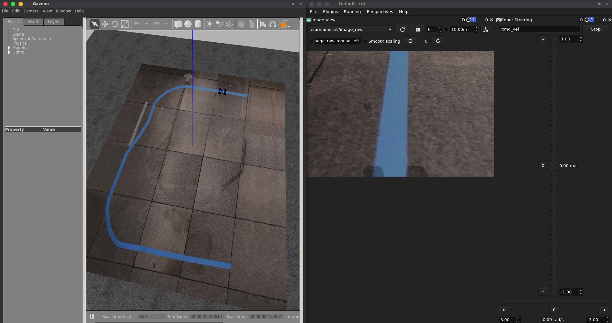

# Toy Car Simulation



Workspace for simulation a toy Ackermann vehicle

## Setup

### 1. Clone this repo

Clone this repo into your src directory

```
$ cd <ros_ws>/src
$ git clone <this repo>
```

### 2. Install `ros_control` packages

Install `ros-control` packages:

```
sudo apt-get install ros-kinetic-ros-control ros-kinetic-ros-controllers
```

### 3. Build

```
$ cd ~/<ros_ws>
$ catkin_make
$ source devel/setup.bash
```

### 4. Floor Model

Go into the models directory and run the following script:

```
$ cd ~/<ros_ws>/src/toy_car_sim/models
$ sh copy_model.sh
```

## Running

```
roslaunch ackermann_vehicle_gazebo ackermann_vehicle.launch
```

### Topics

  - **Camera:** `/car/camera1/image_raw`
  - Twist command: `/prizm_twist_controller/twist_cmd`
